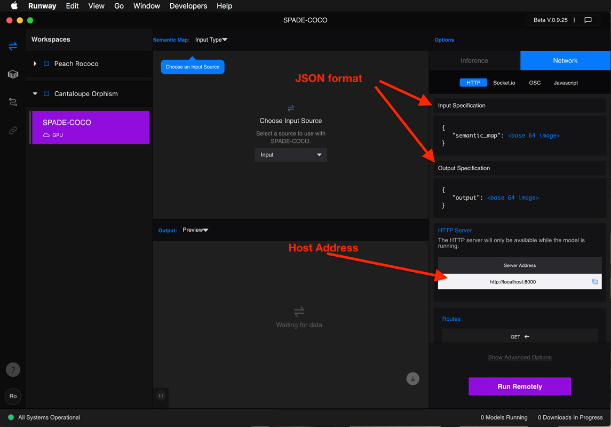

<p align="center">
  
</p>

#  ofxRunway
### RunwayML + openFrameworks

[openFrameworks](http://openframeworks.cc/) addon that allows you to easily integrate [RunwayML](https://runwayml.com/) into your openFrameworks App.
It contains examples on most of the currently available models.

## Install
Download and copy or `git clone` this addon into your openFrameworks addons folder.

Generate or update the example projects by dragging their folders onto the projectGenerator and hitting "update" or "generate".

## Dependencies

You'll need to install the following addons for this addon to work:

* [ofxHTTP](https://github.com/bakercp/ofxHTTP)
* [ofxIO](https://github.com/bakercp/ofxIO)
* [ofxMediaType](https://github.com/bakercp/ofxMediaType)
* [ofxNetworkUtils](https://github.com/bakercp/ofxNetworkUtils)
* [ofxSSLManager](https://github.com/bakercp/ofxSSLManager)


## Instructions

Open an example and compile. When running it you must have your RunwayML app running, with the same model as the example running in a Workspace. The examples are named after each model.

For models that accept images as input, there are usually two examples: one which uses your computer's webcam and continously streams frames to RunwayML, and the other one opens an image file and processes it once.


## Explanation

RunwayML's method of communication with other applications is using some network protocol. So far, HTTP is the one implemented.

ofxRunway takes charge of making the needed requests via HTTP on its own thread, as well as receiving the response and processing it when needed; if the response is an image it will decode it, and put into an ofImage.

RunwayML expects to receive and return data in the JSON format.

The particular format for what is sent and received can be queried by calling
`http://localhost:8000/info` which will return a JSON file with the structure for the input and output packages.

You can find the host name as well as the input and output specification of the model you want to run directly inside the RunwayML app. Select your model in the Workspace, and then select Network at the top of the right side bar to find the specifications.

<p align="center">
  
</p>

### Classes

ofxRunway has the following classes:

#### **ofxRunwayListener**
  * This is an abstract class.
  * The idea is that you extend your `ofApp` class by delcaring it like this
    ```cpp
    class ofApp : public ofBaseApp, public ofxRunwayListener`
    ```
  as well as adding and implementing the following callback functions:
	```cpp
	void runwayInfoEvent(ofJson& info){}
	void runwayErrorEvent(string& message){}
	```
   which will get called whenever needed by `ofxRunway`. You should use this as a means for communication with `ofxRunway`.
  * In order for these callbacks to work you need to setup your `ofxRunway` instance by calling
```cpp
runway.setup(this, "http://localhost:8000");
```
assuming that you are calling it from within `ofApp` and the second parameter is the correct one.


####  **ofxRunway**

  * Is the main class, which is in charge of managing the sending and receiving of data.
  * All the HTTP calls are executed on a different thread, so it won't block your app while waiting for a response.
  *  It includes several handy functions for sending and receiving different data types.
  *  It is designed to be thread safe. You don't need to take care of mutexes.

##### **Public Methods**
######  setup
* Run any of these during setup or if for some reason you want to reset the connection during runtime.
* Only use the version with two arguments when you have implemented your class extending `ofxRunwayListener` as described previously.
* You can get the host string from RunwayML app, which is usually defaulted to `"http://localhost:8000"`;

    ```cpp
    bool setup(const string& host);
	 bool setup(ofxRunwayListener& listenerClass, const string& host);
	 bool setup(ofxRunwayListener* listenerClass, const string& host);   
	 ```

######  send
* Send an `ofxRunwayData` instance with the necessary data by calling ` void send(ofxRunwayData & data);`
* This will create the call on its own thread, so it won't block your main app.
* There are also the following handy functions to be used when you only need to send a single item:
    ```cpp
    bool send(const string& name, const ofBaseHasPixels& img, ofxRunwayImageType type =OFX_RUNWAY_JPG, int resize_width = 0, int resize_height = 0);
    bool send(const string& name, const ofPixels& pix, ofxRunwayImageType type = OFX_RUNWAY_JPG, int resize_width = 0, int resize_height = 0);
    bool send(const string& name, string& data);
    ```

######  tryReceive
```cpp
bool tryReceive(ofxRunwayData & data);
```

This function will check if there is any new data, and if there is, it will move or copy this new data to the `ofxRunwayData` instance you pass to it and will return true. If there is no new data it will return false. It is intended to be called from within your `ofApp::update` function. There is no need to make any other checks or conditions; if there is nothing it will return immediately with very little overhead.

Just like the send methods there are a few handy functions that you can use when expecting a single element to be returned:
```cpp
bool get(const string& name, ofImage& img);
bool get(const string& name, ofPixels& pix);
bool get(const string& name, string& data);
bool get(vector<ofxRunwayCaption>& captions, float imgWidth, float imgHeight);
```

###### Other methods

* `bool isBusy();`

  Will return true if `ofxRunway` has sent a request and is waiting for a response, otherwise will return false;


* `ofxRunwayState getState();`

  Will return the current state of `ofxRunway`. This is a thread-safe function.
 `ofxRunwayState` is an enum which has the following possible values

  * `OFX_RUNWAY_DISCONNECTED` initial default state
  * `OFX_RUNWAY_SETUP` it has been set up but no attempt of getting any data from the RunwayML server has been done
  * `OFX_RUNWAY_CONNECTED`  set up and connected to RunwayML server but no data has been received back
  * `OFX_RUNWAY_RUNNING`  connected and getting data from server
  * `OFX_RUNWAY_CONNECTION_REFUSED` There was an error while trying to connect to server. Probably RunwayML is not running or the model in the RunwayML Workspace is not running.

* `string getStateAsString(bool bVerbose = false);`

  * Will return the status as as string. If you pass `true` as an argument it will return extra info.
  * Used by `drawStatus()`


* `const string& getHost();`
  * Returns the host address.

* `ofRectangle drawStatus(int x = 20, int y = 20,  bool bVerbose = false);`
  * Draws the current status using ofBitmapFont
  * `x` X-axis coordinate where to draw the text
  * `y` y-axis coordinate where to draw the text
  * `bVerbose` if true draw the verbose (full text) for the current state.
  * returns the bounding box of the text drawn.
* `const ofJson& getInputType(const string& name);`
  * Returns the `ofJson` object with info for the input types with the name passed as an argument.
* `const ofJson& getOutputType(const string& name);`
  * Returns the `ofJson` object with info for the output types with the name passed as an argument.
* `const ofJson& getInputTypes();`
  * Returns the full `ofJson` object with info about the sent data.
* `const ofJson& getOutputTypes();`
  * Returns the full `ofJson` object with info about the received data.

* `bool isServerAvailable();`
  * Returns true if connected to the server.

##### **Public variables**

* `ofEvent<ofJson> infoEvent;`
  * Event triggered when a new info event has arrived. This will happen as soon as `ofxRunway` successfully connects to the RunwayML app. It will usually only happen once.

* `ofEvent<string> errorEvent;`
  * Event triggered when a there has been an error, either in sending or receiving. The event will contain a string with information about the error.


####  **ofxRunwayData**

  * This class provides useful functions for setting and getting data into the JSON data required by RunwayML.
  * Essentially it stores the data in an `ofJson` object, although it has a lot of very useful functions for setting and getting the data.

##### **Public methods**
###### Getters

  * The following `get` functions require a string as the first argument which is the name of the element you want to get or set. These names are the ones given by RunwayML in its infoEvent (you'll see these printed in the console).
  * The second argument of these is a reference to an object of the type you want to get.
  * It will return true if the element was found and its info was copied into the reference passed in the second argument.  
  * All these behave in the same way and only differ on the data type asked for.
  * These are named according to the data type that these will get.

	* `bool getImage(const string& name,ofBaseHasPixels& pixels);`
	* `bool getImage(const string& name, ofPixels& pixels);`
	* `bool getBoolean(const string& name, bool &b);`
	* `bool getInt(const string& name, int& i);`
	* `bool getFloat(const string& name, float& f);`
	* `bool getString(const string& name, string& s);`
	* `bool getFloats(const string& name, vector<float>& f);`
	* `bool getStrings(const string& name, vector<string>& s);`
	* `bool getFloatVectors(const string& name, vector<vector<float> >& v);`

* example
```cpp
    ofxRunwayData dataToReceive;// this might be declared elsewhere
    ofImage img;// this might be declared elsewhere
		if(dataToReceive.getImage("image", img)){
		    //if it returned true, then it means that an image was extracted form the `dataToReceive` object, decoded and copied into the `img` object.
		}
```
###### Get captions
There is the`ofxRunwayCaption` struct, whose declaration is the following.
```cpp
  struct ofxRunwayCaption{
	ofRectangle rect;
	string label;
	void draw();
};
```

  * The following two functions allow you to get a collection of `ofxRunwayCaption` objects. The difference between the two is that one is `static` while the other is not.

  * You pass a reference to a `vector<ofxRunwayCaption>` along with the width and height of the image over which the captions go, so these can get scaled accordingly.

	* `bool getCaptions(vector<ofxRunwayCaption>& captions, float imgWidth, float imgHeight);`
	* `static bool getCaptions(vector<ofxRunwayCaption>& captions, const ofJson& data, float imgWidth, float imgHeight);`


###### Get segmentation map
  * The segmentation map is simply a bunch of unique colors which have been associated with a label (string).

	typedef std::map<ofColor, string, colorComp> SegmentationMap;

	* static bool getSegmentationMap(SegmentationMap & segMap, const ofJson& info);
	* static string findSegmentationLabel(const SegmentationMap & segMap, const ofBaseHasPixels& pixels, size_t x, size_t y);
	* static string findSegmentationLabel(const SegmentationMap & segMap, const ofPixels& pixels, size_t x, size_t y);


##### **Public variables**

* `ofJson data;`
  This is where the actual data is stored.

## Contributing

🎉Community Contribution


This is still a work in progress. Contributions are welcomed!

## History
* v1. [Original addon](https://github.com/genekogan/ofxRunway) by [Gene Kogan](https://github.com/genekogan/) 🎉
* v2. Updated, with many examples by [Roy Macdonald](https://github.com/roymacdonald/) 🎉

Note: v1 and v2 are not compatible even though they share a lot of code.
